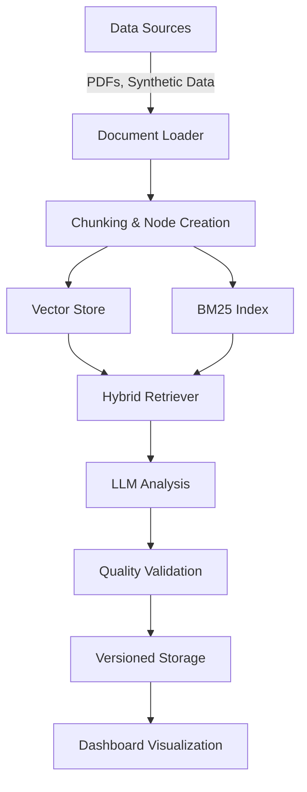

# 📊 Financial Analysis Workstation - AI-Powered SEC Filing Analysis

## 🌟 Executive Summary

The **Financial Analysis Workstation** is a sophisticated AI-powered platform designed for deep analysis of SEC filings and financial documents. This production-grade system combines cutting-edge NLP techniques with financial domain expertise to provide:

- **Comprehensive SEC filing analysis** with structured insights
- **Hybrid search capabilities** combining semantic and keyword search
- **Version-controlled document management** for auditability
- **Quality monitoring** with validation metrics
- **Analytics dashboard** for performance tracking

Built using **LlamaIndex**'s advanced features, this system demonstrates professional-grade implementation of retrieval-augmented generation (RAG) for financial analysis.

## 🛠️ Key Technologies & Concepts Implemented

### 1. **Multi-Source Document Ingestion Pipeline**

- **Problem**: Financial data comes from various sources (PDFs, synthetic data, user uploads) with different formats
- **Solution**:
  - Implemented a flexible `FinancialDataLoader` class handling PDF parsing with metadata preservation
  - Used `SentenceSplitter` for intelligent chunking (1024 tokens with 200 token overlap)
  - Converted all documents to standardized `TextNode` format with metadata inheritance
- **LlamaIndex Concepts**:
  - `Document` and `TextNode` abstraction
  - Metadata propagation across nodes
  - Custom document loaders with chunking

### 2. **Hybrid Search System**

- **Problem**: Financial queries require both semantic understanding and precise term matching
- **Solution**:
  - Combined **BM25** (keyword search) with **vector embeddings** (semantic search)
  - Implemented **Reciprocal Rank Fusion (RRF)** for score combination
  - Used `BAAI/bge-large-en-v1.5` embeddings optimized for financial text
- **LlamaIndex Concepts**:
  - `BM25Retriever` for keyword search
  - `VectorStoreIndex` for semantic search
  - Custom retrieval pipelines with score fusion

### 3. **Versioned Index Management**

- **Problem**: Financial analysis requires audit trails and version control
- **Solution**:
  - Created `VersionedIndex` system with snapshot capabilities
  - Implemented commit/rollback functionality
  - Tracked metadata including document counts and company coverage
- **LlamaIndex Concepts**:
  - `StorageContext` persistence
  - Index versioning patterns
  - Document store management

### 4. **Quality Validation Framework**

- **Problem**: Need to ensure consistent, high-quality financial analysis
- **Solution**:
  - Implemented response validation with 6 required sections
  - Created scoring system (0-1 scale) evaluating:
    - Completeness
    - Citation count
    - Risk assessment presence
    - Recommendation quality
  - Built analytics dashboard tracking metrics over time
- **LlamaIndex Concepts**:
  - Response evaluation patterns
  - Prompt engineering for structured output
  - Analysis post-processing

### 5. **Financial-Specific Prompt Engineering**

- **Problem**: Generic responses lack financial rigor
- **Solution**:
  - Created specialized prompt template with:
    - Executive summary requirements
    - Leadership structure analysis
    - Risk scoring (1-5 scale)
    - Documentary evidence citations
    - Comparative analysis
    - Actionable recommendations
  - Added professional formatting requirements
- **LlamaIndex Concepts**:
  - `PromptTemplate` usage
  - Domain-specific prompting
  - Structured output control

### 6. **Production-Grade Monitoring**

- **Problem**: Need visibility into system performance
- **Solution**:
  - Implemented `QueryMonitor` tracking:
    - Latency metrics
    - Result counts
    - Query patterns
  - Built comprehensive dashboard with:
    - Time series charts
    - Performance metrics
    - Correlation analysis
- **LlamaIndex Concepts**:
  - Query analytics patterns
  - Performance optimization
  - Production monitoring

## 🏛️ Architecture Overview



## Installation

```bash
# Clone the repository
git clone https://github.com/SyedArmghanAhmad/LlamaIndex-Complete-with-Projects.git

# Navigate to the project directory
cd LlamaIndex-Complete-with-Projects/LlamaIndex/End-to-End\ Project/

# Install dependencies (recommended to use Python 3.9+)
pip install -r requirements.txt

# Set up environment variables
cp .env.example .env
# Edit the .env file with your API keys and configurations
```

## 🎯 Key Features

### 🔍 Intelligent Search Capabilities

- **Hybrid search** combining best of keyword and semantic approaches
- **Metadata filtering** by company, filing type, and date ranges
- **Relevance ranking** optimized for financial documents

### 📈 Professional-Grade Analysis

- **Structured output** with 6 required sections
- **Risk scoring system** (1-5 scale) for leadership dependence
- **Comparative analysis** against industry benchmarks
- **Citation tracking** with document references

### 🛡️ Enterprise-Grade Management

- **Version control** with commit/rollback capabilities
- **Quality monitoring** with validation scoring
- **Performance tracking** with latency metrics
- **Document provenance** tracking

## 🧠 Financial Domain Innovations

1. **Succession Risk Scoring**  
   Automated assessment of leadership concentration risk with mitigation analysis

2. **Governance Gap Detection**  
   Identifies omissions in succession planning documentation

3. **Temporal Pattern Analysis**  
   Tracks changes in leadership structure over multiple filings

4. **Regulatory Compliance Checks**  
   Flags potential compliance issues in governance disclosures

## 📊 Sample Use Cases

1. **Investor Due Diligence**  
   "Analyze CEO succession plans among FAANG companies"

2. **Risk Assessment**  
   "Identify companies with high leadership concentration risk"

3. **Governance Benchmarking**  
   "Compare board independence policies in tech vs financial sectors"

4. **Regulatory Review**  
   "Verify compliance with SEC governance disclosure requirements"

## 🚀 Implementation Highlights

- **Production-Ready Patterns**: Error handling, retries, and fallback mechanisms
- **Performance Optimized**: Hybrid search reduces latency while improving recall
- **Domain-Tuned**: Financial-specific embeddings and prompt engineering
- **Audit-Friendly**: Complete version history and document provenance

## 💡 Why This Matters

This system demonstrates how to:

- Apply advanced NLP to complex financial documents
- Build trustworthy AI analysis with validation
- Create maintainable production RAG systems
- Solve real business problems in governance analysis

The implementation showcases professional-grade usage of LlamaIndex while solving meaningful problems in financial analysis.

---

**Note**: This project is part of my professional portfolio demonstrating production-grade implementation of advanced RAG systems. The code showcases sophisticated patterns that can be adapted to various document analysis use cases.
