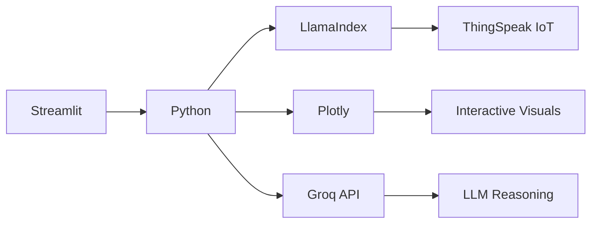

# 🏭 Manufacturing IoT Assistant

*Real-time monitoring meets AI-powered insights for your factory floor*

## 🌟 Overview

The **Manufacturing IoT Assistant** is a cutting-edge dashboard that combines real-time machine monitoring with an intelligent conversational assistant. Designed for engineers and plant managers, this tool transforms raw sensor data into actionable insights with:

- **Real-time vibration & temperature tracking**  
- **Predictive maintenance alerts**  
- **Historical trend analysis**  
- **AI-powered troubleshooting**  

Built with Python, Streamlit, and LlamaIndex, it bridges the gap between your IoT sensors and operational decision-making.

## 🛠️ Core Features

### 📊 Interactive Dashboard

- **Live machine status cards** with color-coded alerts
- **Animated gauge charts** showing real-time sensor readings
- **Historical trend visualizations** with configurable time windows
- **Dark mode interface** designed for control room environments

### 🤖 AI Assistant

- **Natural language queries** about machine status
- **Maintenance recommendations** based on sensor thresholds
- **Troubleshooting guidance** for common issues
- **Conversational interface** with memory

### ⚙️ Simulation Mode

- **Generate synthetic sensor data** for testing
- **Configurable anomaly injection** to validate alert systems
- **No hardware required** for evaluation

## 🧩 Technology Stack



- **Frontend**: Streamlit (Python)  
- **AI Engine**: LlamaIndex + Groq (Llama 3 70B)  
- **Visualizations**: Plotly interactive charts  
- **IoT Integration**: ThingSpeak API  
- **Embeddings**: HuggingFace (BAAI/bge-small-en-v1.5)  

## 🚀 Quick Start

Here's the complete **Quick Start** guide with the cloning step added as Step 1:

---

## 🚀 Quick Start

1. **Clone the Repository**:
   ```bash
   git clone https://github.com/SyedArmghanAhmad/LlamaIndex-Complete-with-Projects.git
   cd LlamaIndex-Complete-with-Projects/LlamaIndex/Multi-Agent-Systems-for-Manufacturing
   ```

2. **Prerequisites**:
   ```bash
   Python 3.9+
   ```

3. **Installation**:
   ```bash
   pip install -r requirements.txt
   ```

4. **Configuration**:
   Create `.env` file with:
   ```ini
   GROQ_API_KEY=your_key_here
   READ_KEY_IOT=your_thingspeak_key
   WRITE_KEY_IOT=optional_simulation_key
   CHANNEL_ID_IOT=your_channel_id
   ```

5. **Launch**:
   ```bash
   streamlit run manufacturing_assistant.py
   ```

---

## 🎨 Design Philosophy

> "The most profound technologies are those that disappear. They weave themselves into the fabric of everyday life until they are indistinguishable from it."  
> — Mark Weiser

This project embodies:

- **Industrial Aesthetics**: Dark theme with high-contrast alerts
- **At-a-Glance Understanding**: Gauge charts mimic physical control panels
- **Conversational UX**: Natural language interface reduces training needs
- **Responsive Architecture**: Auto-refreshing data with persistent chat

## 📈 Sample Use Cases

1. **Shift Handover**:  
   *"Show me all machines needing attention before next shift"*

2. **Root Cause Analysis**:  
   *"Why is Machine X vibrating excessively?"*

3. **Preventive Maintenance**:  
   *"Which machines are due for lubrication this week?"*

4. **Process Optimization**:  
   *"Compare temperature trends between Line A and Line B"*

## 📜 License

MIT License - Free for commercial and personal use with attribution.

---

🔧 *Built for the factories of tomorrow* 🔧
