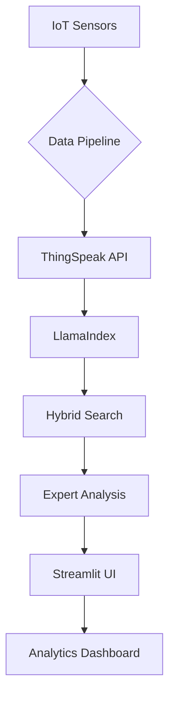

# AI-Powered Manufacturing and Financial Intelligence Platform

**End-to-End AI Solutions for Manufacturing and Financial Analysis**  
*Combining IoT, Multi-Agent Systems, and Advanced Document Processing*

---

## 📌 Overview

This repository contains a collection of AI-powered projects designed to solve real-world problems in manufacturing and financial analysis. The projects leverage cutting-edge technologies, including **LlamaIndex**, **Groq LLMs**, **IoT integration**, and **multi-agent systems**, to deliver actionable insights and intelligent automation.

---

## 🚀 Projects

### 1. **Multi-Agent Systems for Manufacturing**

- **Description**: A multi-agent system for quality control and maintenance in manufacturing environments. It uses IoT data, quality control protocols, and maintenance schedules to provide real-time recommendations.
- **Key Features**:
  - Hybrid search (vector + BM25) for defect analysis.
  - Dynamic metadata filtering for severity-based queries.
  - Real-time IoT data integration.
  - Maintenance scheduling and defect resolution recommendations.
- **Technologies**: LlamaIndex, Groq, HuggingFace Embeddings, ChromaDB, ThingSpeak API.
- **Notebook**: [Multi-Agent Systems for Manufacturing.ipynb](./Multi-Agent_Systems_for_Manufacturing.ipynb)

---

### 2. **IoT-Enabled Manufacturing Intelligence**

- **Description**: A real-time IoT data integration system for monitoring manufacturing equipment. It uses sensor data (vibration, temperature, operational hours) to provide maintenance alerts and operational insights.
- **Key Features**:
  - Real-time data fetching from ThingSpeak.
  - Dynamic document generation for live sensor data.
  - Maintenance recommendations based on operational thresholds.
  - Enhanced error handling and retry mechanisms.
- **Technologies**: ThingSpeak API, LlamaIndex, Groq, HuggingFace Embeddings.
- **Notebook**: [BetterVer.ipynb](./BetterVer.ipynb)

---

### 3. **Financial Document Intelligence**

- **Description**: A system for analyzing financial documents (10-K, 10-Q, 8-K filings) using hybrid search and advanced NLP techniques. It provides structured insights into financial metrics, risk factors, and strategic updates.
- **Key Features**:
  - PDF document processing with chunking.
  - Hybrid search (vector + BM25) for financial queries.
  - Expert-level financial analysis with structured outputs.
  - Interactive query interface.
- **Technologies**: LlamaIndex, Groq, HuggingFace Embeddings, PyPDF2, BM25.
- **Notebook**: [Financial_Document_Intelligence.ipynb](./Financial_Document_Intelligence.ipynb)

---

### 4. **SEC Filing Analysis Platform**

- **Description**: A platform for analyzing SEC filings with advanced querying and expert-level financial insights. It supports version-controlled indexing and real-time analytics.
- **Key Features**:
  - Version-controlled document indexing.
  - Expert-level financial analysis prompts.
  - Real-time query analytics dashboard.
  - Metadata filtering for precise queries.
- **Technologies**: LlamaIndex, Groq, HuggingFace Embeddings, Streamlit.
- **Notebook**: [SEC_Filing_Analysis_Platform.ipynb](./SEC_Filing_Analysis_Platform.ipynb)

---

## 🛠️ Installation

### Prerequisites

- Python 3.10+
- Groq API Key
- ThingSpeak API Key (for IoT projects)
- 8GB+ RAM recommended

### Quick Start

1. Install dependencies:

   ```bash
   pip install -r requirements.txt
   ```

2. Configure environment variables:

   ```bash
   echo "GROQ_API_KEY=your_groq_key_here" > .env
   echo "CHANNEL_ID_IOT=your_thingspeak_channel_id" >> .env
   echo "READ_KEY_IOT=your_thingspeak_read_key" >> .env
   echo "WRITE_KEY_IOT=your_thingspeak_write_key" >> .env
   ```

---

## 🧠 Usage

### Running the Projects

1. **Multi-Agent Systems for Manufacturing**:

   ```bash
   jupyter notebook Multi-Agent_Systems_for_Manufacturing.ipynb
   ```

2. **IoT-Enabled Manufacturing Intelligence**:

   ```bash
   jupyter notebook BetterVer.ipynb
   ```

3. **Financial Document Intelligence**:

   ```bash
   jupyter notebook Financial_Document_Intelligence.ipynb
   ```

4. **SEC Filing Analysis Platform**:

   ```bash
   streamlit run app.py
   ```

---

## 📊 System Architecture



---

## 🧩 Tech Stack

| Component              | Technology                          |
|------------------------|-------------------------------------|
| **AI Framework**       | LlamaIndex                          |
| **LLM Provider**       | Groq (Mixtral-8x7b-32768)          |
| **Embeddings**         | HuggingFace BGE-Large               |
| **Vector DB**          | ChromaDB                            |
| **UI Framework**       | Streamlit                           |
| **IoT Integration**    | ThingSpeak API                      |
| **Data Processing**    | Pandas, NumPy                       |
| **Document Processing**| PyPDF2, PDFPlumber                  |

---

## 🤝 Contributing

We welcome contributions from AI engineers, manufacturing experts, and financial analysts:

1. Fork the repository.
2. Create feature branches (`feature/your-idea`).
3. Submit PR with comprehensive tests.
4. Join our [Community Discord](https://discord.gg/your-link).

---

## 📜 License

MIT License - See [LICENSE](LICENSE) for full text.

---

## 🌟 Acknowledgments

- **LlamaIndex Team** for the revolutionary AI framework.
- **Groq** for ultra-fast LLM inference.
- **HuggingFace** for state-of-the-art embeddings.
- **ThingSpeak** for IoT data integration.

---

*"Transforming Manufacturing and Finance with AI"* - Me
